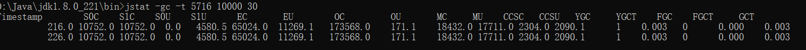
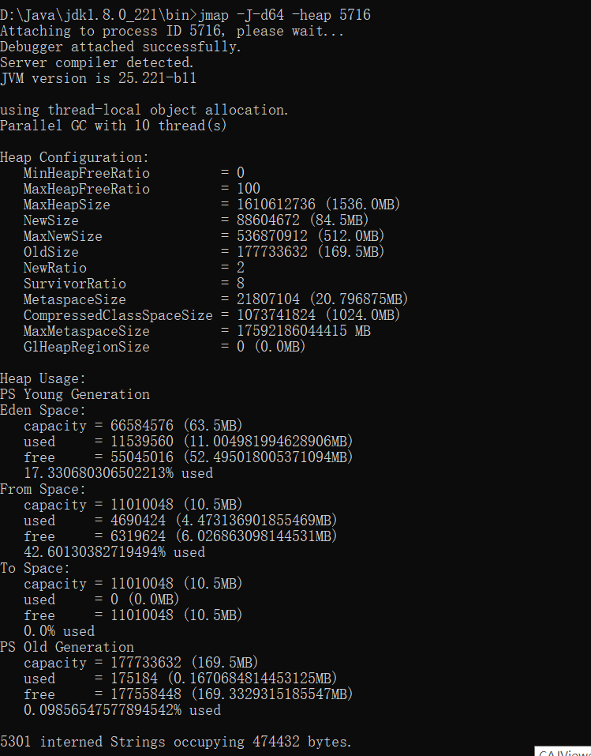
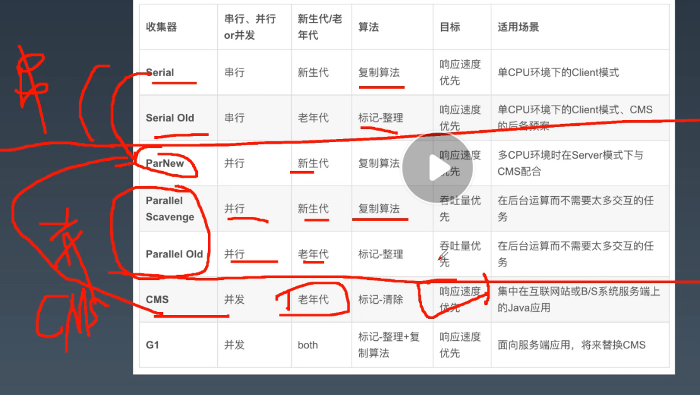
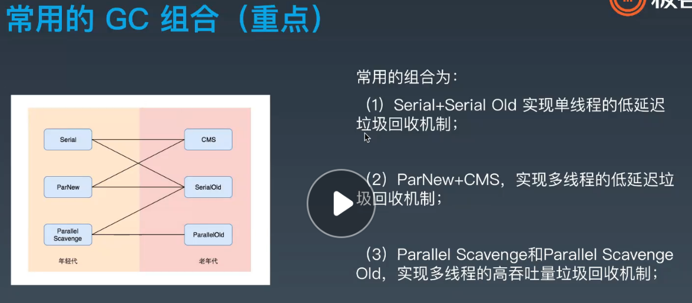
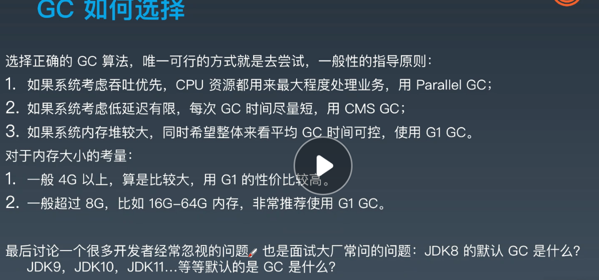
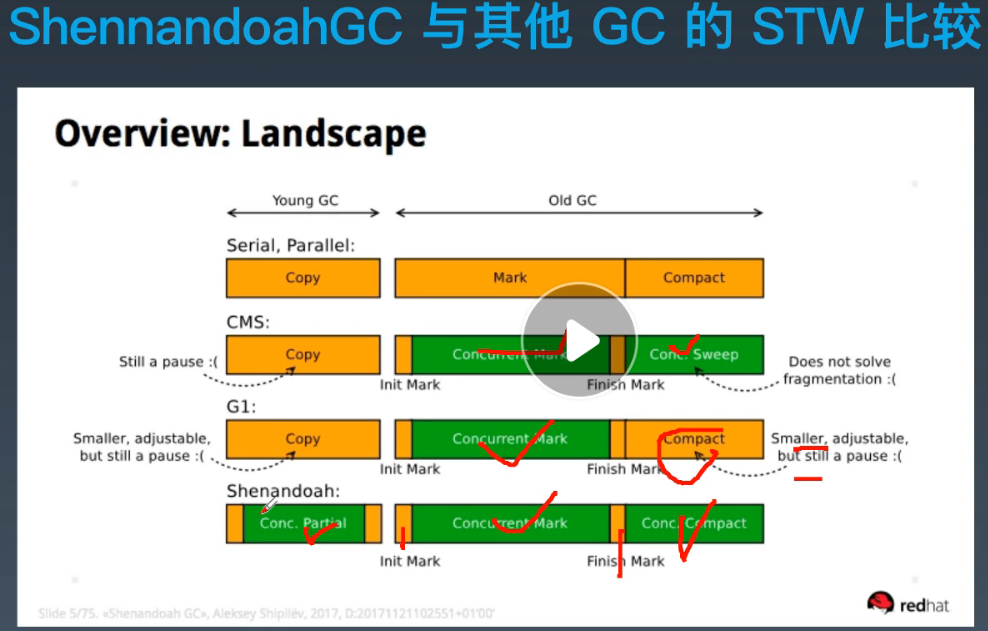
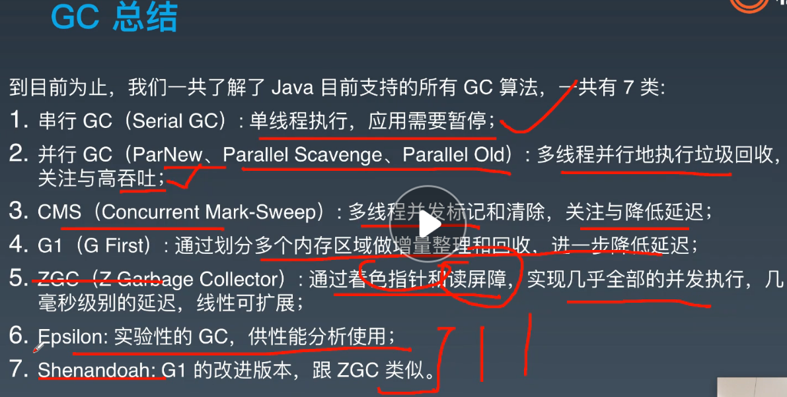
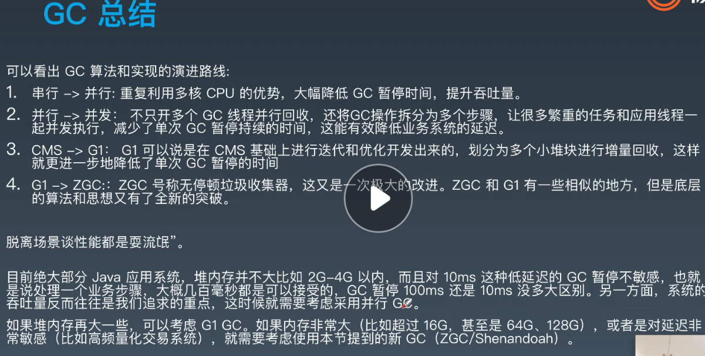

学习笔记	

# 第一课

## 一、常用性能维度

1. 延迟(Latency)： 一般衡量的是响应时间(Response Time)，比如平均响应时间。
   但是有时候响应时间抖动的特别厉害，也就是说有部分用户的响应时间特别高，
   这时我们一般假设我们要保障95%的用户在可接受的范围内响应，从而提供绝大
   多数用户具有良好的用户体验，这就是延迟的95线（P95，平均100个用户请求
   中95个已经响应的时间），同理还有99线，最大响应时间等（95线和99线比较
   常用；用户访问量大的时候，对网络有任何抖动都可能会导致最大响应时间变得
   非常大，最大响应时间这个指标不可控，一般不用）。
2. 吞吐量(Throughput)： 一般对于交易类的系统我们使用每秒处理的事务数(TPS)
   来衡量吞吐能力，对于查询搜索类的系统我们也可以使用每秒处理的请求数
   （QPS）。
3. 系统容量(Capacity)： 也叫做设计容量，可以理解为硬件配置，成本约束。

 整体上使用分布式的解决办法，以及局部上对每个系统进行分析调优，是性价比最高的选择

## 二、性能指标两类

1. 业务需求指标：如吞吐量(QPS、TPS)、响应时间(RT)、并发数、业务成功率
   等。
2. 资源约束指标：如CPU、内存、I/O等资源的消耗情况。

## 三、采用的手段和方式

1. 内存分析: Dump分析/GC日志分析
2. 调整JVM启动参数，GC策略等等
3. 使用JDWP或开发工具做本地/远程调试
4. 系统和JVM的状态监控，收集分析指标
5. 性能分析: CPU使用情况/内存分配分析

```
编译源代码，生成字节码文件
javac -g:vars xxx.java
查看字节码信息
javap -c -verbose xxx.class
```

## 四、JVM基础知识

### 1、语言分类


### 2、如果按照有没有虚拟机来划分，高级编程语言可分为两类：
- 有虚拟机：Java，Lua，Ruby，部分JavaScript的实现等等
- 无虚拟机：C，C++，C#，Golang，以及大部分常见的编程语言

### 3. 运行时和JVM

简单的说JRE就是Java的运行时，包括虚拟机和相关的库等资源。  

### 4、字节码

Java中的字节码，英文名为  bytecode , 是Java代码编译后的中间代码格式。JVM需要读取并解析字节码才能执行相应的任务。JVM加载字节码格式的class文件，校验之后通过JIT编译器转换为本地机器代码执行

操作码， 下面称为  指令 , 主要由 类型前缀 和 操作名称 两部分组成。

```
例如，' i ' 前缀代表 ‘ integer ’，所以，' iadd ' 很容易理解, 表示对整数执行加
法运算。
```

根据指令的性质，主要分为四个大类：

根据指令的性质，主要分为四个大类：

1. 栈操作指令，包括与局部变量交互的指令
2. 程序流程控制指令
3. 对象操作指令，包括方法调用指令
4. 算术运算以及类型转换指令
此外还有一些执行专门任务的指令，比如同步(synchronization)指令，以及抛出异常
相关的指令等等

获取字节码清单：

```
javac demo/jvm0104/HelloByteCode.java
javap ‐c ‐verbose demo.jvm0104.HelloByteCode
```

反编译 class 时，指定  ‐verbose  选项, 则会  输出附加信息 。

常量池就是一个常量的大字典，使用编号的方式把程序里用到的各类常量统一管理起来，这样在字节码操作里，只需要引用编号即可。

JVM是一台基于栈的计算机器。每个线程都有一个独属于自己的线程栈(JVM stack)，用于存储 栈帧 (Frame)。每一次方法调用，JVM都会自动创建一个栈帧。 栈帧  由 操作数栈 ，  局部变量数组  以及一个 class引用 组成。 class引用  指向当前方法在运行时常量池中对应的class)。局部变量数组  也称为  局部变量表 (LocalVariableTable), 其中包含了方法的参数，以及局部变量。 局部变量数组的大小在编译时就已经确定: 和局部变量+形参的个数有关，还要看每个变量/参数占用多少个字节。操作数栈是一个LIFO结构的栈， 用于压
入和弹出值。 它的大小也在编译时确定。有一些操作码/指令可以将值压入“操作数栈”； 还有一些操作码/指令则是从栈中获取操作数，并进行处理，再将结果压入栈。操作数栈还用于接收调用其他方法时返回的结果值。


字节码编辑：是使用ASM和Javassist之类的字节码操作工具，也可以在类加载器和Agent上面做文章其实要使用编程的方式，方便和安全地实现字节码编辑和修改还有更好的办法，那就

给局部变量赋值时，需要使用相应的指令来进行  store ，如  astore_1 。 store类的指令都会删除栈顶值。  
相应的  load  指令则会将值从局部变量表压入操作数栈，但并不会删除局部变量中的值。


类加载时机：


怎么看到加载了哪些类，以及加载顺序？只需要在类的启动命令行参数加上 ‐XX:+TraceClassLoading  或者  ‐verbose  即
可，注意需要加载java命令之后，要执行的类名之前，不然不起作用。例如：

```
$ java ‐XX:+TraceClassLoading jvm.HelloClassLoader 
```

怎么调整或修改ext和本地加载路径？

```
$ java ‐Dsun.boot.class.path="D:\Program Files\Java\jre1.8.0_231\lib\rt.jar"
启动类加载器
   ==> file:/D:/Program%20Files/Java/jdk1.8.0_231/jre/lib/rt.jar
扩展类加载器 ClassLoader ‐> sun.misc.Launcher$ExtClassLoader@15db9742
应用类加载器 ClassLoader ‐> sun.misc.Launcher$AppClassLoader@73d16e93
   ==> file:/D:/git/studyjava/build/classes/java/main/
   ==> file:/D:/git/studyjava/build/resources/main
```

### 5、JVM内存模型

1. 变量表（先进栈操作后存入本地变量表），常量池（初始化后放常量和类），栈（计算后放入变量表）

2. jvm内存模型:栈，堆（年轻代Young-gen（新生代Eden-space，存活区Survivor，以前叫持久代Permanentgeneration,分为S0,S1）、老年代Old-gen，给业务用,受jvm管理），非堆（持久代（元数据空间Metaspace(方法区（常量池）)、CSS和code cache（JIT））,给系统使用）和堆外（directory memory，给业务使用，JNI和JIT开辟出来的直接内存（Native memory）属于堆外，不受jvm管理）和jvm自身使用的内存。

3. 方法的变量槽位在栈帧的局部变量表中。
   对象的属性域，位于堆中分配给这个对象的内存中。
   静态字段在class对象的内存中，和普通对象区别不大。
   常量池之中就是java代码里的字面量，一切可见的字符可能都会放到常量池。
   数字常量，比如1，一般被优化为字节码指令，不在常量池。
   final  字段和普通字段在存储上没区别。


1. 堆内存启动参数：
     堆内：
     -Xms:指定堆内存初始大小，指定的内存大小，并不是操作系统实际分配的初始值，而是GC先规划好，使用才分配。专用服务器上Xms和Xmx保持一致，否则应用刚启动可能会有好几个FullGC.当两者配置不一致时，堆内存扩容可能会导致性能抖动。
     -Xmx:指定堆内存最大内存，如 -Xmx4g这只是限制了Heap部分的最大值为4g。这个内存不包括栈内存，也不包括堆外使用的内存。Xmx配置一般不要超过系统可用内存的60%-80%
     -Xmn:等价于 -XX:NewSize,表示新生代初始内存的大小，应该小于-Xms的值，使用G1垃圾收集器不应该设置该选项，在其他的某些业务场景下可以设置。官方建议设置为 -Xmx的 1/2~1/4
     -XX:MaxnewSize：表示新生代可被分配的内存的最大上限；当然这个值应该小于-Xmx的值；
     -XX:PermSize：表示非堆区初始内存分配大小（方法区）
     -XX:MaxPermSize=size,表示对非堆区分配的内存的最大上限（方法区）。这是jdk1.7之前使用的，8以后默认允许的Meta空间无限大，此参数无效
     -XX:MaxMetaspaceSize=size,java8默认不限制Meta空间，一般不允许设置该选项。
     -XX:MaxDirecMemorySize=size,系统可是使用的最大堆外内存，这个参数跟 -Dsun.nio.MaxDirectMemorySize效果相同
     -Xss,设置每个线程栈的字节数，例如-Xss1m指定线程栈为1MB,与-XX：ThreadStackSize=1m等价，假如Xmx配置了1G，怎么保证可以开辟2000线程，则此参数可以设置成1G/2000=500K来保证开辟更多线程

课后作业

# 第一课第1题

1（可选）、自己写一个简单的 Hello.java，里面需要涉及基本类型，四则运行，if 和for，然后自己分析一下对应的字节码，有问题群里讨论。

```
地址：Hello.java
```

# 第一课第2题

2（必做）、自定义一个 Classloader，加载一个 Hello.xlass 文件，执行 hello 方法，此文件内容是一个 Hello.class 文件所有字节（x=255-x）处理后的文件。文件群里提供。

```
MyClassLoaderFile.java
```

# 第一课第3题

3（必做）、画一张图，展示 Xmx、Xms、Xmn、Metaspache、DirectMemory、Xss这些内存参数的关系。

.png)


# 第一课第4题

4（可选）、检查一下自己维护的业务系统的 JVM 参数配置，用 jstat 和 jstack、jconsole、jmap查看一下详情，并且自己独立分析一下大概情况，思考有没有不合理的地方，如何改进。
注意：
1、对于线上有流量的系统，慎重使用jmap命令。
2、如果没有线上系统，可以自己 run 一个 web/java 项目。或者直接查看idea进程。

jconsole:

.png)

jstat:可以查看堆内存各部分的使用量，以及加载类的数量。命令的格式如下：

 jstat [-命令选项] [vmid] [间隔时间/毫秒] [查询次数]

详情参见：https://www.cnblogs.com/yjd_hycf_space/p/7755633.html

```
列出当前JVM版本支持的选项，常见的有
l  class (类加载器) 
l  compiler (JIT) 
l  gc (GC堆状态) 
l  gccapacity (各区大小) 
l  gccause (最近一次GC统计和原因) 
l  gcnew (新区统计)
l  gcnewcapacity (新区大小)
l  gcold (老区统计)
l  gcoldcapacity (老区大小)
l  gcpermcapacity (永久区大小)
l  gcutil (GC统计汇总)
l  printcompilation (HotSpot编译统计)
```


```
ps -ef|grep java | grep xxx
jstat -gc -t 11656 10000 30 
-gc ：将显示与垃圾收集相关的统计信息
自JVM启动以来的-t时间戳将被打印
11656：目标JVM进程ID
10000：每10,000毫秒（即10秒）将打印一次统计信息。
30 ：将打印30次迭代的统计信息。 因此，以上选项将导致JVM打印指标300秒（即10秒x 30次迭代）。
```



```
S0C –S0区域的容量，以KB为单位
S1C –S1区域的容量，以KB为单位
S0U –S0区域使用的空间以KB为单位
S1U –S1区域以KB为单位使用空间
EC –新生代容量（KB）
EU –新生代已利用空间（以KB为单位）
OC –老年代容量（KB）
OU –老年代的已利用空间，以KB为单位
MC –元空间区域容量，以KB为单位
MU –元空间区域使用的空间以KB为单位
CCSC –压缩类空间CCS区域的容量，以KB为单位
CCSU –压缩类空间CCS区域以KB为单位使用空间
YGC  –迄今为止发生的年轻代GC事件的数量
YGCT –到目前为止，年轻代GC花费的时间
FGC  –迄今为止已发生的完全GC事件的数量
FGCT –到目前为止已花费的完整GC时间
GCT  –到目前为止所花费的GC时间总量（基本上是YGCT + FGCT）
```

jstack:用于打印出给定的java进程ID或core file或远程调试服务的Java堆栈信息，如果是在64位机器上，需要指定选项"-J-d64"，

Windows的jstack使用方式只支持以下的这种方式：jstack [-l] pid

如果java程序崩溃生成core文件，jstack工具可以用来获得core文件的java stack和native stack的信息，从而可以轻松地知道java程序是如何崩溃和在程序何处发生问题。另外，jstack工具还可以附属到正在运行的java程序中，看到当时运行的java程序的java stack和native stack的信息, 如果现在运行的java程序呈现hung的状态，jstack是非常有用的。

参见：https://www.cnblogs.com/xingzc/p/5778010.html

http://www.blogjava.net/jzone/articles/303979.html

http://blog.csdn.net/fenglibing/article/details/6411940

```
需要注意的问题:

l 不同的 JAVA虚机的线程 DUMP的创建方法和文件格式是不一样的，不同的 JVM版本， dump信息也有差别。

l 在实际运行中，往往一次 dump的信息，还不足以确认问题。建议产生三次 dump信息，如果每次 dump都指向同一个问题，我们才确定问题的典型性。 

2、命令格式

$jstack [ option ] pid

$jstack [ option ] executable core

$jstack [ option ] [server-id@]remote-hostname-or-IP

参数说明:

pid: java应用程序的进程号,一般可以通过jps来获得;

executable:产生core dump的java可执行程序;

core:打印出的core文件;

remote-hostname-or-ip:远程debug服务器的名称或IP;

server-id: 唯一id,假如一台主机上多个远程debug服务;
```


jmap:可以输出所有内存中对象的工具，甚至可以将VM 中的heap，以二进制输出成文本。

　　打印出某个java进程（使用pid）内存内的，所有‘对象’的情况（如：产生那些对象，及其数量）。

64位机上使用需要使用如下方式：

```
jmap -J-d64 -heap 5716
```



解析结果：

```
using parallel threads in the new generation.  ##新生代采用的是并行线程处理方式
using thread-local object allocation.   
Concurrent Mark-Sweep GC   ##同步并行垃圾回收 

Heap Configuration:  ##堆配置情况，也就是JVM参数配置的结果[平常说的tomcat配置JVM参数，就是在配置这些]
   MinHeapFreeRatio = 40 ##最小堆使用比例
   MaxHeapFreeRatio = 70 ##最大堆可用比例
   MaxHeapSize      = 2147483648 (2048.0MB) ##最大堆空间大小
   NewSize          = 268435456 (256.0MB) ##新生代分配大小
   MaxNewSize       = 268435456 (256.0MB) ##最大可新生代分配大小
   OldSize          = 5439488 (5.1875MB) ##老年代大小
   NewRatio         = 2  ##新生代比例
   SurvivorRatio    = 8 ##新生代与suvivor的比例
   PermSize         = 134217728 (128.0MB) ##perm区 永久代大小
   MaxPermSize      = 134217728 (128.0MB) ##最大可分配perm区 也就是永久代大小

Heap Usage: ##堆使用情况【堆内存实际的使用情况】
New Generation (Eden + 1 Survivor Space):  ##新生代（伊甸区Eden区 + 幸存区survior(1+2)空间）
   capacity = 241631232 (230.4375MB)  ##伊甸区容量
   used     = 77776272 (74.17323303222656MB) ##已经使用大小
   free     = 163854960 (156.26426696777344MB) ##剩余容量
   32.188004570534986% used ##使用比例
Eden Space:  ##伊甸区
   capacity = 214827008 (204.875MB) ##伊甸区容量
   used     = 74442288 (70.99369812011719MB) ##伊甸区使用
   free     = 140384720 (133.8813018798828MB) ##伊甸区当前剩余容量
   34.65220164496263% used ##伊甸区使用情况
From Space: ##survior1区
   capacity = 26804224 (25.5625MB) ##survior1区容量
   used     = 3333984 (3.179534912109375MB) ##surviror1区已使用情况
   free     = 23470240 (22.382965087890625MB) ##surviror1区剩余容量
   12.43827838477995% used ##survior1区使用比例
To Space: ##survior2 区
   capacity = 26804224 (25.5625MB) ##survior2区容量
   used     = 0 (0.0MB) ##survior2区已使用情况
   free     = 26804224 (25.5625MB) ##survior2区剩余容量
   0.0% used ## survior2区使用比例
PS Old  Generation: ##老年代使用情况
   capacity = 1879048192 (1792.0MB) ##老年代容量
   used     = 30847928 (29.41887664794922MB) ##老年代已使用容量
   free     = 1848200264 (1762.5811233520508MB) ##老年代剩余容量
   1.6416783843721663% used ##老年代使用比例
Perm Generation: ##永久代使用情况
   capacity = 134217728 (128.0MB) ##perm区容量
   used     = 47303016 (45.111671447753906MB) ##perm区已使用容量
   free     = 86914712 (82.8883285522461MB) ##perm区剩余容量
   35.24349331855774% used ##perm区使用比例
```

# 二、第二课

java命令
  开发部署运行命令行：
    java:启动Java应用程序
    javac:JDK内置的编译工具
    javap:反编译class文件的工具，用助记符的方式看字节码
    javah:JNI开发时，根据java代码生成需要的.h文件
    jar:打包工具，可以将文件和目录打包成jar包。使用时按照顺序对应好参数和选项即可。
    javadoc:根据java代码和标准注释生成API说明文档
    extcheck:检查某个jar或者运行时扩展jar有没有版本冲突，很少使用
    jdb:Java Debugger;可以调试本地或远端程序。属于JPDA的一个demo实现，用于其他调试器参考，很少使用
    jdeps:探测class或者jar包的需要的依赖
    keytool:安全证书和秘钥的管理工具（支持导入，导出，生成等操作）
    jarsigner:jar文件签名和验证工具
    policytool:图形界面工具，管理本机的java安全策略
  辅助工具命令行：
    jps/jinfo:查看java进程
      jps:显示进程pid
      jps -l:显示类jar包和pid
      jps -mlv:详细进程信息和对应命令行参数和pid

    jstat:查看JVM内部gc相关信息，可持续观测gc每秒情况
      jstat -gc pid 1000 10 :查看gc情况，每1秒打一次，打10次
      jstat -gcutil pid 1000 10:显示gc百分比情况
      jstat -gcnew pid 1000 10 :只看yang区,-gcold只看old区
    
    jmap:查看heap或者类占用空间统计
      jmap -heap pid:打印堆内存（内存池）的配置和使用信息。
      jmap -histo pid >aaa.txt:看哪些类占用的空间最多，实例数和类型
      jmap -dump:format=b,file=xxx.hprof pid: Dump堆内存
    
    jstack:查看线程信息
    jstack -l :线程信息详情
    
    jcmd:执行JVM相关分析命令（整合命令）
      jcmd pid help:查看各种命令行如下
        The following commands are available:
        JFR.stop
        JFR.start
        JFR.dump
        JFR.check
        VM.native_memory
        VM.check_commercial_features
        VM.unlock_commercial_features
        ManagementAgent.stop
        ManagementAgent.start_local
        ManagementAgent.start
        VM.classloader_stats
        GC.rotate_log
        Thread.print
        GC.class_stats
        GC.class_histogram
        GC.heap_dump
        GC.finalizer_info
        GC.heap_info
        GC.run_finalization
        GC.run
        VM.uptime
        VM.dynlibs
        VM.flags
        VM.system_properties
        VM.command_line
        VM.version
        help
      jcmd pid GC.heap_info
    
    jrunscript/jjs:执行js命令,当curl命令使用：
      jrunscript -e "cat('http:www.baidu.com')"
      jrunscript -e "print('hello,kk,sdsd'+1)"
      jrunscript -l js -f /XXX/XXX/test.js
      jjs:进入命令行
    kill -3 pid:发送信号3给进程，打印出堆栈
    kill -9 pid:发送信号9给进程，关闭进程

  图形工具：
  jconsole:图形界面查看堆和非堆内存使用情况，cpu占用率，线程和类，检测死锁
  jvisualvm:cpu，堆栈，类，线程，还可以看Profiler抽样，一段时间内发生的方法，类调用比较多，创建的对象
  visualGC:插件，idea插件中安装
  jmc：比较强大，参数较多，还有统计计算功能，飞行记录器保存文件。线上不建议使用，线上使用可能造成各种问题，干扰正在运行的服务

GC原理：内存资源有限性，因此需要大家共享使用，手工申请，手动释放。
        但实际情况复杂，对象之间互相依赖引用，导致无法释放内存
  分代假设：大部分新生对象很快无用；存活较长时间的对象，可能存活更长时间
  改进：内存池分代，年轻代（新生代，S0,S1，8:1:1），老年代，不同类型对象不同区域，不同策略处理
        YoungGC（minor）的时候将新生代存活的（极少）和S0中合并复制入S1,然后清空新生代和S0。下次相反，将新生代存活的和S1中存活的对象复制放入S0,然后清空新生代和S1.如果15次younggc还在的移动到老年代。参考 -XX: +MaxTenuringThread=15
        持久代/元数据区
        1.8之前： -XX:MaxPermSize=256m
        1.8之后： -XX:MaxMetaspaceSize=256m
        为什么新生代对象是复制到存活区，对象到老年代是移动方式？？？
  可以作为GC Roots的对象
    1.当前正在执行方法的局部变量和入参
    2.活动线程
    3.所有类的静态字段
    4.JNI引用
    标记此阶段暂停的时间，与堆内存大小，对象的总数没有直接关系，而是由存活对象（可达对象）的数量决定的。所以，增加堆内存的大小并不会直接影响标记阶段占用的时间。标记阶段时间很快


  改进：引用计数改为引用跟踪
    标记清除算法（Mark-Sweep）：
      Marking(标记)：遍历所有可达对象，并在本地内存（native）中分门别类几下。
      Sweeping（清除）：这一步保证了，不可达对象所占内存，在之后进行内存分配时可以重用。
      并行GC和CMS GC （Concurrence Mark sweep）使用了此原理
      优势：可以处理循环依赖，只扫描部分对象
      除了清除，还要压缩
      怎么才能标记和清除清楚上百万对象呢？答案就是STW(stop total world)，让全世界停止下来.
    标记复制算法（Mark-Copy）：对yuoung区快

    标记清除整理算法(Mark-Sweep-Compact)：对old区比较好
    
    各有什么优缺点：

串行GC(Serial GC)/ParNewGC
  -XX: +UseSerialGC 参数配置串行GC
  串行GC对年轻代使用标记复制算法，对老年代使用标记清除整理算法
  两者都是单线程的垃圾收集器，不能进行并行处理，所以，会触发权限暂停STW
  因此这种GC算法不能充分利用多核CPU,不管多少CPU内核，JVM在垃圾回收时只能使用单个核心
  效率低下，现在很少使用，比如一个保洁阿姨打扫·卫生，叫所有人出去，打扫完毕在回来。
  只适合几百MB堆内存的JVM,而且是单核cpu时比较有用。
  -XX: +UseParNewGC 改进版本的串行GC，可以配合CMS使用。

并行GC(Parallel GC) :jdk8使用，jdk6,7,8版本jvm默认的GC,是吞吐量最大的GC
  -XX: +UseParallelGC或者 -XX: +UseParallelOldGC 或者 -XX: +UseParallelGC -XX: +UseParallelOldGC 三者是一样的
  并行GC对年轻代使用标记复制算法，对老年代使用标记清除整理算法
  -XX: ParallelGCThreads=N 来指定GC线程数，其默认值为CPU核心数。
  年轻代和老年代的垃圾回收都会触发暂停STW事件。
  比如多个保洁阿姨打扫卫生，叫所有人出去停止工作，快速打扫完毕在回来。
  并行适用于多核服务器，主要目标是增加吞吐量。因为对系统资源的有效使用，能达到额公告的吞吐量：
    -在GC期间，所有cpu内核都在并行清理垃圾，所以，总暂停事件更短
    -在两次GC周期的间隔期，没有GC线程在运行，不会消耗任何系统资源。

并发GC CMS GC(Mostly Concurrent Mark and Sweep Garbage Collectopr)
  适合要求低延迟，不要求大吞吐量的系统，要求大吞吐量还是要用并行GC
  -XX: +UseConcMarkSweepGC
  其对年轻代采用并行STW方式的标记复制算法，对老年代主要使用并发标记清除算法。
  CMS GC的设计目标是避免在老年代垃圾收集时出现长时间的卡顿，主要是通过两种手段来达成此目标：、
    1.不对老年代进行整理，而是使用空闲列表（free-lists）来管理内存空间的回收。
    2.在标记清除阶段的大部分工作是和应用程序一起并发执行。
    也就是说，在这些阶段并没有明显的应用现场暂停。但仍然和应用线程争抢CPU时间。默认情况下，CMS使用的并发线程数等于cpu核心数的1/4.3/4的还是留给业务使用。
    比如一群阿姨打扫卫生时，同时可以工作，不用出去。
    如果服务器是多核的，并且主要调优目标是降低GC停顿导致的系统延迟，那么采用CMS是个明智的选择。进行老年代的并发回收时，可能伴随着多次年轻代的minor GC.
  6个阶段：详见ppt课件
    1.初始化标记
    2.并发标记
    3.并发预清理
    4.最终标记
    5.并发清除
    6.并发重置

    思考：并行Parallel与并发Concurrent的区别？

G1 GC(Garbage-First)，垃圾优先，哪块垃圾最多就优先清理它
  -XX: +UseG1GC -XX:MaxGCPauseMillis=T 调整暂停时间，达到多次GC，每次回收部分内存。
  目标：将STW停顿的时间和分布，变成可预期可配置的。
  堆不再分成年轻代和老年代，而是划分多个（2048个）可以存放对象的小块堆区域（smaller heap regions）.每个小块，可能会被定义成Eden区，一会又被指定为Survivor区或者Old区。在逻辑上，所有Eden区和Survivor区合起来成为年轻代，所有old区合起来就是老年代。
  每次处理一部分，优先处理垃圾占比比较大的区域，每次GC暂停会处理所有年轻代的内存块，但一般只处理部分老年代的内存区域块。
  原则：垃圾最多占比（存活的对象总数/整体总对象）的小块会被优先回收。
  参数：具体见ppt
  注意事项：容易退化成串行GC，暂停时间甚至达到秒级
    1）并发模式失败，老年代被填满，增加堆大小或者调整周期（增加线程数 -XX: ConctThreads）
    2）晋升失败,m没有足够的内存供存活对象或晋升对象使用，由此出发FullGC
        解决办法：
          a) 增加 -XX: G1ReservePercent 选项的值（并相应增加总的堆大小）增加预留内存量
          b) 通过减少 -XX: initiatingHeapOccupancyPercent 提前启动标记周期
          c) 也可以通过增加 -XX: ConcGCThreads选项的值来增加并行标记现场的数量。
    3）巨型对象分配失败，当巨型对象找不到合适的空间进行分配时，就会启动FullGC,来释放空间。
        解决办法：
          增加内存或者增大 -XX: G1HeapRegionSize

ZGC:jdk11,oracle开发，亲儿子，立项晚但开发快，从8迁移到11,改rt.jar(被拆分)配置就可以

```
1.GC最大停顿时间不超过10ms
2.堆内存支持范围广，从几百兆的堆空间到4TB的超大堆空间内存（JDK13升至16TB）
3.与G1比，吞吐量下降15%，比并行会更进一步下降
4.当前只支持linux/x64位平台，jdk15后才支持mac和windows系统
```

ShenandoahGC：本质和特性与ZGC相同jdk12，红帽开发，做的慢。linux上支持到8就可以用，其他系统不行。

ZGC和仙那度GC共同鼻祖：azul的PausenessGC,效果很好，延迟在1毫秒以内。mac和windows中要jdk15版本才能用上边的GC

各种GC对比



各GC组合：



如何选择GC?经过压测尝试比较后选择，理论原则只能指导生产，不能决定生产。



jdk8：长期维护版本，还可以用5-8年
		jdk11:下一个长期维护版本
		jdk15：
		jdk17:下下个长期维护版本
		每半年发一个版本
各版本GC的暂停时间STW比较:



GC总结：





## 作业：

1、本机使用 G1 GC 启动一个程序，仿照课上案例分析一下 JVM 情况，可以使用gateway-server-0.0.1-SNAPSHOT.jar
			 注意关闭自适应参数：-XX:-UseAdaptiveSizePolicy 防止jvm被jvm自动调整。
			启动参数：-XX: +UseAdaptiveSizePolicy 由jvm来自动调整各参数

```bash
java -Xmx1g -Xms1g -XX:-UseAdaptiveSizePolicy -XX:+UseSerialGC  -jar target/gateway-server-0.0.1-SNAPSHOT.jar
java -Xmx1g -Xms1g -XX:-UseAdaptiveSizePolicy -XX:+UseParallelGC -jar target/gateway-server-0.0.1-SNAPSHOT.jar
java -Xmx1g -Xms1g -XX:-UseAdaptiveSizePolicy -XX:+UseConcMarkSweepGC -jar target/gateway-server-0.0.1-SNAPSHOT.jar
java -Xmx1g -Xms1g -XX:-UseAdaptiveSizePolicy -XX:+UseG1GC -XX:MaxGCPauseMillis=50 -jar target/gateway-server-0.0.1-SNAPSHOT.jar
使用jmap，jstat，jstack，以及可视化工具，查看jvm情况。
mac上可以用wrk，windows上可以按照superbenchmark压测 http://localhost:8088/api/hello 查看jvm。
```

分析结果参见：

```
第一周第2课作业.txt
```

