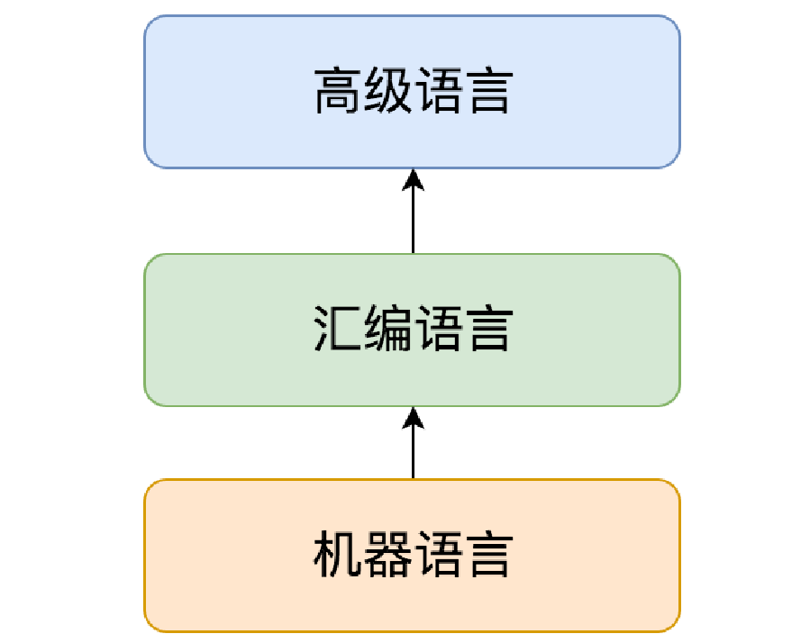
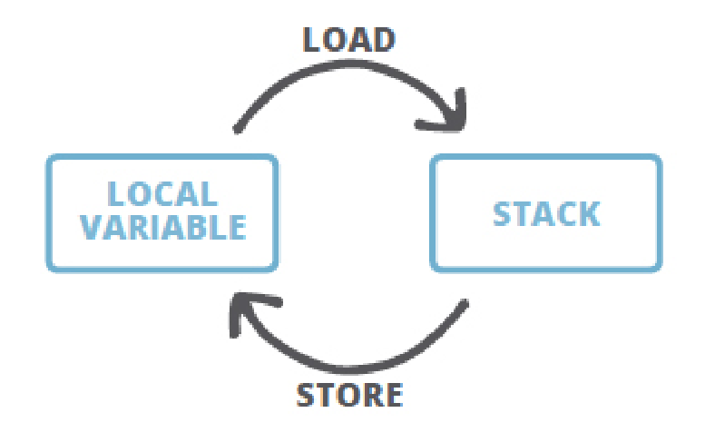

学习笔记	

## 一、常用性能维度

1. 延迟(Latency)： 一般衡量的是响应时间(Response Time)，比如平均响应时间。
   但是有时候响应时间抖动的特别厉害，也就是说有部分用户的响应时间特别高，
   这时我们一般假设我们要保障95%的用户在可接受的范围内响应，从而提供绝大
   多数用户具有良好的用户体验，这就是延迟的95线（P95，平均100个用户请求
   中95个已经响应的时间），同理还有99线，最大响应时间等（95线和99线比较
   常用；用户访问量大的时候，对网络有任何抖动都可能会导致最大响应时间变得
   非常大，最大响应时间这个指标不可控，一般不用）。
2. 吞吐量(Throughput)： 一般对于交易类的系统我们使用每秒处理的事务数(TPS)
   来衡量吞吐能力，对于查询搜索类的系统我们也可以使用每秒处理的请求数
   （QPS）。
3. 系统容量(Capacity)： 也叫做设计容量，可以理解为硬件配置，成本约束。

 整体上使用分布式的解决办法，以及局部上对每个系统进行分析调优，是性价比最高的选择

## 二、性能指标两类

1. 业务需求指标：如吞吐量(QPS、TPS)、响应时间(RT)、并发数、业务成功率
   等。
2. 资源约束指标：如CPU、内存、I/O等资源的消耗情况。

## 三、采用的手段和方式

1. 内存分析: Dump分析/GC日志分析
2. 调整JVM启动参数，GC策略等等
3. 使用JDWP或开发工具做本地/远程调试
4. 系统和JVM的状态监控，收集分析指标
5. 性能分析: CPU使用情况/内存分配分析

```
编译源代码，生成字节码文件
javac -g:vars xxx.java
查看字节码信息
javap -c -verbose xxx.class
```

## 四、JVM基础知识

### 1、语言分类



### 2、如果按照有没有虚拟机来划分，高级编程语言可分为两类：
- 有虚拟机：Java，Lua，Ruby，部分JavaScript的实现等等
- 无虚拟机：C，C++，C#，Golang，以及大部分常见的编程语言

### 3. 运行时和JVM

简单的说JRE就是Java的运行时，包括虚拟机和相关的库等资源。  

### 4、字节码

Java中的字节码，英文名为  bytecode , 是Java代码编译后的中间代码格式。JVM需要读取并解析字节码才能执行相应的任务。JVM加载字节码格式的class文件，校验之后通过JIT编译器转换为本地机器代码执行

操作码， 下面称为  指令 , 主要由 类型前缀 和 操作名称 两部分组成。

```
例如，' i ' 前缀代表 ‘ integer ’，所以，' iadd ' 很容易理解, 表示对整数执行加
法运算。
```

根据指令的性质，主要分为四个大类：

根据指令的性质，主要分为四个大类：

1. 栈操作指令，包括与局部变量交互的指令
2. 程序流程控制指令
3. 对象操作指令，包括方法调用指令
4. 算术运算以及类型转换指令
此外还有一些执行专门任务的指令，比如同步(synchronization)指令，以及抛出异常
相关的指令等等

获取字节码清单：

```
javac demo/jvm0104/HelloByteCode.java
javap ‐c ‐verbose demo.jvm0104.HelloByteCode
```

反编译 class 时，指定  ‐verbose  选项, 则会  输出附加信息 。

常量池就是一个常量的大字典，使用编号的方式把程序里用到的各类常量统一管理起来，这样在字节码操作里，只需要引用编号即可。

JVM是一台基于栈的计算机器。每个线程都有一个独属于自己的线程栈(JVM stack)，用于存储 栈帧 (Frame)。每一次方法调用，JVM都会自动创建一个栈帧。 栈帧  由 操作数栈 ，  局部变量数组  以及一个 class引用 组成。 class引用  指向当前方法在运行时常量池中对应的class)。局部变量数组  也称为  局部变量表 (LocalVariableTable), 其中包含了方法的参数，以及局部变量。 局部变量数组的大小在编译时就已经确定: 和局部变量+形参的个数有关，还要看每个变量/参数占用多少个字节。操作数栈是一个LIFO结构的栈， 用于压
入和弹出值。 它的大小也在编译时确定。有一些操作码/指令可以将值压入“操作数栈”； 还有一些操作码/指令则是从栈中获取操作数，并进行处理，再将结果压入栈。操作数栈还用于接收调用其他方法时返回的结果值。


字节码编辑：是使用ASM和Javassist之类的字节码操作工具，也可以在类加载器和Agent上面做文章其实要使用编程的方式，方便和安全地实现字节码编辑和修改还有更好的办法，那就

给局部变量赋值时，需要使用相应的指令来进行  store ，如  astore_1 。 store类的指令都会删除栈顶值。  
相应的  load  指令则会将值从局部变量表压入操作数栈，但并不会删除局部变量中的值。



类加载时机：


怎么看到加载了哪些类，以及加载顺序？只需要在类的启动命令行参数加上 ‐XX:+TraceClassLoading  或者  ‐verbose  即
可，注意需要加载java命令之后，要执行的类名之前，不然不起作用。例如：

```
$ java ‐XX:+TraceClassLoading jvm.HelloClassLoader 
```

怎么调整或修改ext和本地加载路径？

```
$ java ‐Dsun.boot.class.path="D:\Program Files\Java\jre1.8.0_231\lib\rt.jar"
启动类加载器
   ==> file:/D:/Program%20Files/Java/jdk1.8.0_231/jre/lib/rt.jar
扩展类加载器 ClassLoader ‐> sun.misc.Launcher$ExtClassLoader@15db9742
应用类加载器 ClassLoader ‐> sun.misc.Launcher$AppClassLoader@73d16e93
   ==> file:/D:/git/studyjava/build/classes/java/main/
   ==> file:/D:/git/studyjava/build/resources/main
```

### 5、JVM内存模型

1. 变量表（先进栈操作后存入本地变量表），常量池（初始化后放常量和类），栈（计算后放入变量表）

2. jvm内存模型:栈，堆（年轻代Young-gen（新生代Eden-space，存活区Survivor，以前叫持久代Permanentgeneration,分为S0,S1）、老年代Old-gen，给业务用,受jvm管理），非堆（持久代（元数据空间Metaspace(方法区（常量池）)、CSS和code cache（JIT））,给系统使用）和堆外（directory memory，给业务使用，JNI和JIT开辟出来的直接内存（Native memory）属于堆外，不受jvm管理）和jvm自身使用的内存。

3. 方法的变量槽位在栈帧的局部变量表中。
   对象的属性域，位于堆中分配给这个对象的内存中。
   静态字段在class对象的内存中，和普通对象区别不大。
   常量池之中就是java代码里的字面量，一切可见的字符可能都会放到常量池。
   数字常量，比如1，一般被优化为字节码指令，不在常量池。
   final  字段和普通字段在存储上没区别。


1. 堆内存启动参数：
     堆内：
     -Xms:指定堆内存初始大小，指定的内存大小，并不是操作系统实际分配的初始值，而是GC先规划好，使用才分配。专用服务器上Xms和Xmx保持一致，否则应用刚启动可能会有好几个FullGC.当两者配置不一致时，堆内存扩容可能会导致性能抖动。
     -Xmx:指定堆内存最大内存，如 -Xmx4g这只是限制了Heap部分的最大值为4g。这个内存不包括栈内存，也不包括堆外使用的内存。Xmx配置一般不要超过系统可用内存的60%-80%
     -Xmn:等价于 -XX:NewSize,表示新生代初始内存的大小，应该小于-Xms的值，使用G1垃圾收集器不应该设置该选项，在其他的某些业务场景下可以设置。官方建议设置为 -Xmx的 1/2~1/4
     -XX:MaxnewSize：表示新生代可被分配的内存的最大上限；当然这个值应该小于-Xmx的值；
     -XX:PermSize：表示非堆区初始内存分配大小（方法区）
     -XX:MaxPermSize=size,表示对非堆区分配的内存的最大上限（方法区）。这是jdk1.7之前使用的，8以后默认允许的Meta空间无限大，此参数无效
     -XX:MaxMetaspaceSize=size,java8默认不限制Meta空间，一般不允许设置该选项。
     -XX:MaxDirecMemorySize=size,系统可是使用的最大堆外内存，这个参数跟 -Dsun.nio.MaxDirectMemorySize效果相同
     -Xss,设置每个线程栈的字节数，例如-Xss1m指定线程栈为1MB,与-XX：ThreadStackSize=1m等价，假如Xmx配置了1G，怎么保证可以开辟2000线程，则此参数可以设置成1G/2000=500K来保证开辟更多线程

课后作业

# 第一课第1题


# 第一课第2题


# 第一课第3题


# 第一课第4题


